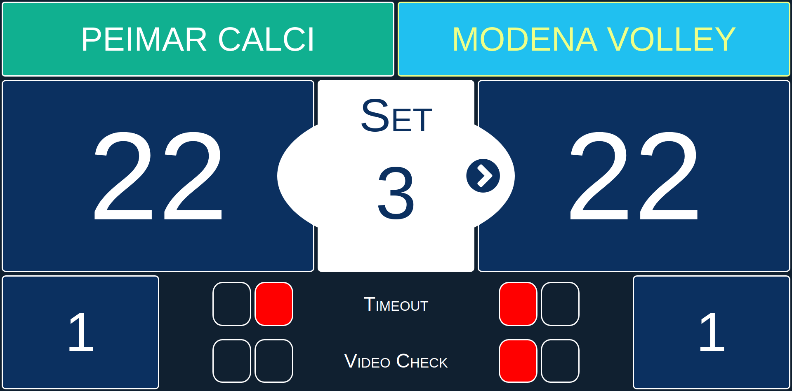
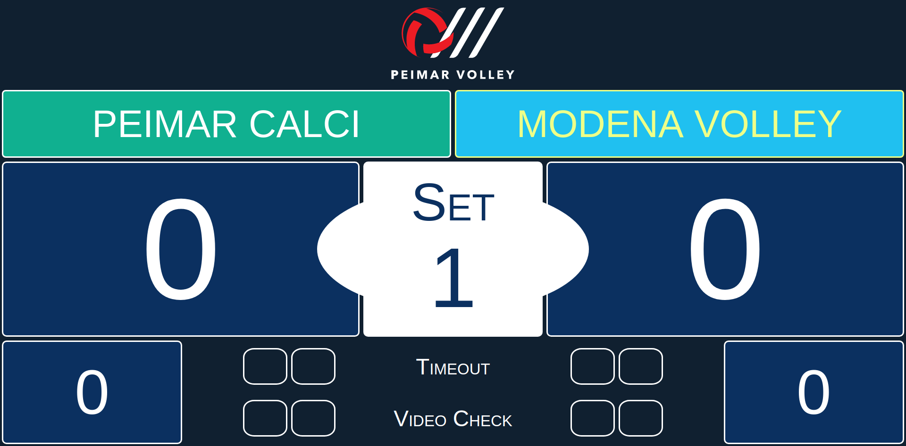
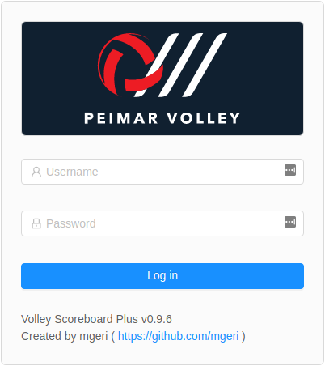
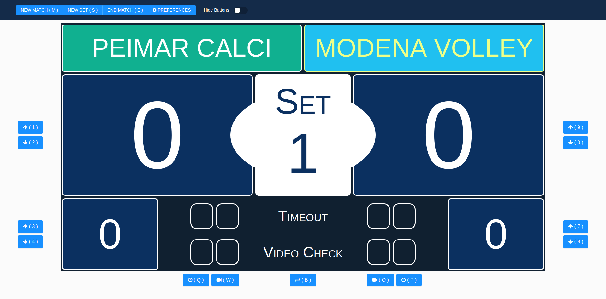
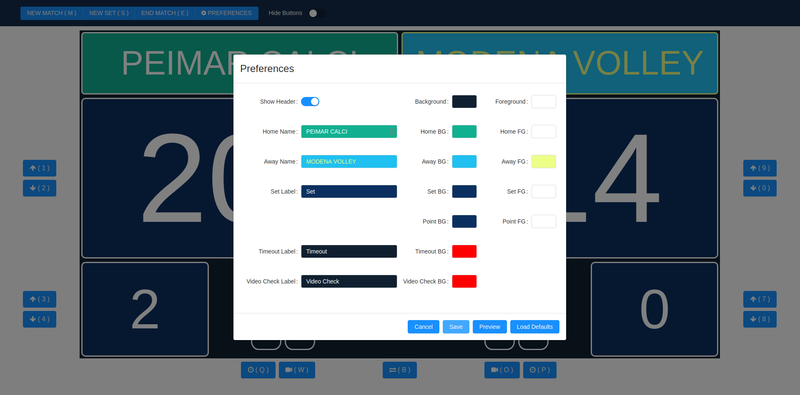

# Volleyball Scoreboard Plus
> A Volleyball Scoreboard written in Go with Angular web front-end. 



Volleyball Scoreboard Plus is an application which could transform your computer or better any HDMI display in a simple Volley Scoreboard.

You can use it for any volleyball associations and any tournaments. 

I started writing it for fun and for our local volley team which this year plays Italian A2 Official League.
The application could be installed on a Raspberry Pi board running as "kiosk" mode and connected by HDMI to any tv display or projector.
The scoreboard could be controlled from wireless remote device like a mobile phone, a tablet or any pc running in a web browser.

The main Go service implements an OpenAPI 3 restful service. It also notifies real time scoreboard updates using WebSockets.

See the [OpenAPI file](api/volleyscoreboard.yaml) for more details.

## Built With
Go restful services:
* [oapi-codegen](https://github.com/deepmap/oapi-codegen): OpenAPI Client and Server Code Generator
* [echo](https://echo.labstack.com/): High performance, extensible, minimalist Go web framework
* [lumberjack](https://github.com/natefinch/lumberjack): Log rolling files
* [cobra](https://github.com/spf13/cobra): Command like support
* [viper](https://github.com/spf13/viper): Flags and file configuration
* [gorilla-websocket](github.com/gorilla/websocket): A fast, well-tested and widely used WebSocket implementation for Go
* [ozzo-validation](https://github.com/go-ozzo/ozzo-validation): An idiomatic Go (golang) validation package

Web UI:
* [angular](https://github.com/angular/angular)
* [ng-bootstrap](https://github.com/ng-bootstrap/ng-bootstrap): Angular powered Bootstrap
* [ng-zorro](https://github.com/NG-ZORRO/ng-zorro-antd): An enterprise-class UI components based on Ant Design and Angular
* [ngx-color-picker](https://github.com/zefoy/ngx-color-picker): Color picker widget for the Angular
* [sweetalert2](https://github.com/sweetalert2/sweetalert2): A beautiful, responsive, highly customizable popup boxes


## Usage
Run the main executable to see the supported command line.
You can configure Go service using a `config.yml` file (see thee `config.sample.yaml`) file for configuration options).


### Main Scoreboard Panel
After the application is running, use your browser to open the service address url to see the main scoreboard panel. For example `http://localhost`.





### Control Panel
You can open the control panel with the `/admin` url, for example `http://localhost/admin`.

You will need to put your credentials (default admin/*, you can change it in the `config.yaml` flle).



After log in in you can see the control panel and start managing the scorebaord preferences and scores.



Use buttons, mouse or touch (if you device supports it) to manage the scoreboard:

* Click or touch the Team Score: increase the score
* Swipe down: decrease the score
* Click or touch the current `Set` area: change ball owner
* Click or touch the number of won sets: increase won sets
* Swipe down the number of won set: decrease won sets
* Click or touch timeout led: increase Timeout (after the second, return to 0)
* Click or touch video check led: increase the Video Check (after the second, return to 0)

If you use touch screen, you can `Hide Buttons`.

Click or touch `New Set` button to start a new set and increase the won set to the team with highest points.

At the end of last set, click or touch the `End Match` to show the winner screen.

To start a new match click or touch the `New Match` button: it will open the preferences dialgo wher eyou can change the team names.

### Preferences
You can change team names, scoreboard colors and text labels opening the `Preferences` dialog.




## Basic Installation

Run the build script `build/buildpkg-all.sh` to build service and web frontend and create the tar/zip archive for the main platforms (arm, linux, windows).

Untar/unzip the archive in your target platform, change the config file if needed and install as service.

## Development setup

Install Go 1.13+ and Node v12+.

## Rasberry Pi Kiosk 

### Installation

Use **chilipie-kiosk**, an easy-to-use Raspberry Pi image for booting directly into full-screen Chrome Kiosk mode: 

[https://github.com/futurice/chilipie-kiosk](https://github.com/futurice/chilipie-kiosk)

Follow the instructions to install the image. Then:

1) after copying the image reinsert the sd card
2) copy *wpa_supplicant.conf* in the **boot** folder (see chilipie instructions) with your wifi access point settings
3) copy an empty file named *ssh* (touch ssh) in the **boot** folder to permanently enable ssh access

Start your Raspberry PI and connect to it.

Note: default user/password are `pi/rasberry` and the default device name (if you don't know the address) is `chilipie-kiosk.local`

**NOTE**: run `sudo raspi-config` to change default root password or hostname and to **update raspberry-pi**

Logo: 
1) upload *logo.png* to rasberry pi home
2) rename *background.png* to *background.orig.png*
3) rename *logo.png* to *background.png*   

### Configure and install

#### Build Rasberry Pi server and package

On the root git project folder, run

`./build/tar/buildpkg.sh linux arm`

Note: build-pkg scripts requires *go* and *nodejs* to be installed on your system

The script builds the volley scoreboard tgz package file into the *bin* folder (*scoreboard-plus-linux-arm.tar.gz*).

#### Install on Rasberry Pi

Copy *scoreboard-plus-linux-arm.tar.gz* to rasberry pi home *~* using sftp/scp.
Copy *scoreboard-plus.service* to rasberry pi home *~* using sftp/scp.

Untar *scoreboard-plus-linux-arm.tar.gz* to /opt:

```
sudo tar -xzf scoreboard-plus-linux-arm.tar.gz -C /opt
```

Install application as service:

1) Copy scoreboard-plus.service service file to systemd:

```
sudo cp /opt/scoreboard-plus/conf/scoreboard-plus.service /lib/systemd/system/
```

2) Run following commands:

```
sudo chmod 644 /lib/systemd/system/scoreboard-plus.service
sudo systemctl daemon-reload`
sudo systemctl enable scoreboard-plus.service
```

Configure default browser url:

1) Go to home: `cd ~`
2) Edit .xsession file: `sudo nano .xsession`
3) Replace `chromium-browser` line with:


```
chromium-browser --start-fullscreen --window-size=1920,1080 --noerrdialogs --disable-translate --no-first-run --fast --fast-start --disable-features=TranslateUI --disable-infobars --kiosk http://127.0.0.1/  &
```

4) Replace `find .config/chromium` with the following:

```
find .config/chromium/ -name "Last *" -exec rm {} +
```

5) Reboot: `sudo reboot`

After rebooting, try to connect to Raspberry and see if the service is running as expected:

```
sudo systemctl status scoreboard-plus.service
```

Now you can connect to main scoreboard with your browser using the following url the check if all is working:
- `http://chilipie-kiosk.local`:  to see the main scoreboard viewer panel
- `http://chilipie-kiosk.local/#/admin`: to login to control panel (default user and password is *admin/admin*, change it in the *config.yml* file if you want)

### Configure Raspberry as Access Point

Follow the instruction [Setting up a Raspberry Pi as a Wireless Access Point - Raspberry Pi Documentation](https://www.raspberrypi.org/documentation/configuration/wireless/access-point.md)

**NOTE**: Configure your Raspberry Pi as access point using cable connection (non wiFi). Below and example of hostapd.conf

```
interface=wlan0
driver=nl80211
ssid=SCOREBOARD-PI
hw_mode=g
channel=7
ieee80211d=1          # limit the frequencies used to those allowed in the country
country_code=IT       # the country code
ieee80211n=1          # 802.11n support
#ieee80211ac=1        # 802.11ac support
wmm_enabled=1
macaddr_acl=0
auth_algs=1
ignore_broadcast_ssid=0
wpa=2
wpa_passphrase=My-WiFi-Password
wpa_key_mgmt=WPA-PSK
wpa_pairwise=TKIP
rsn_pairwise=CCMP
```

Setup as bridge if needed.


## Contributing

Contributions makes the open source community such an amazing place to be learnt, inspire, and create. Any contributions you make are **greatly appreciated**.

## License

Distributed under the MIT License. See `LICENSE` for more information.

